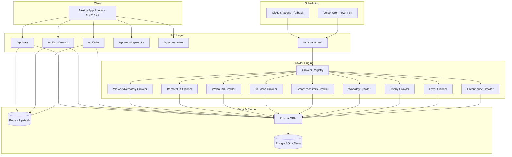

# JobPulse — Global Job Aggregation Engine

JobPulse is a production-ready, high-performance job discovery and intelligence engine that crawls early-career software engineering roles (internships, new grad, backend, infra, platform, AI engineering) across 20+ countries from 9 ATS and remote job boards. It aggregates, normalizes, deduplicates, and ranks jobs with a composite scoring algorithm to find high-growth developer opportunities.

Designed for Vercel, it features Postgres full-text search, Upstash Redis caching, and a modern glassmorphic dashboard.

---

## 🏗️ Architecture Overview



---

## ⚡ Quick Start (Local Development)

### 1. Prerequisites
- **Node.js** v20+
- **PostgreSQL** database (Local instance or [Neon](https://neon.tech) serverless Postgres)
- **Redis** database (Local instance or [Upstash Redis](https://upstash.com))

### 2. Configure Environment Variables
Copy `.env.example` to `.env` and fill in your connection strings:
```bash
cp .env.example .env
```

### 3. Install Dependencies
```bash
npm install
```

### 4. Setup the Database
Push the Prisma schema to your PostgreSQL database and seed the technology taxonomy:
```bash
# Push schema tables and indexes to Postgres
npx prisma db push

# Seed the technology categories and scores
npx prisma db seed
```

### 5. Start the Dev Server
```bash
npm run dev
```
Open [http://localhost:3000](http://localhost:3000) to view the application dashboard and job board.

---

## 🚀 Production Deployment Guide

### Step 1: Provision Cloud Services

#### 1. Serverless PostgreSQL (Neon)
1. Sign up/Log in to [Neon](https://neon.tech).
2. Create a new project named `jobpulse`.
3. In the Neon dashboard, copy your pooled **Connection String** (`postgres://...`).
4. Set it as `DATABASE_URL` in your environment. Append `?sslmode=require` if it is not present.

#### 2. Serverless Redis (Upstash)
1. Sign up/Log in to [Upstash](https://upstash.com).
2. Create a new Redis database in your closest region.
3. Under the **REST API** section, copy the `UPSTASH_REDIS_REST_URL` and `UPSTASH_REDIS_REST_TOKEN`.

#### 3. Cron Security Secret
Generate a unique string to prevent unauthorized crawler execution:
```bash
openssl rand -base64 32
```
Save this as `CRON_SECRET` in your environment.

---

### Step 2: Deploy to Vercel

1. **Push your code to a GitHub Repository**.
2. Go to the [Vercel Dashboard](https://vercel.com) and click **Add New** > **Project**.
3. Select your repository.
4. Add the following **Environment Variables** in the project settings:
   - `DATABASE_URL` (Neon Postgres url with pooled connection)
   - `UPSTASH_REDIS_REST_URL` (Upstash REST API URL)
   - `UPSTASH_REDIS_REST_TOKEN` (Upstash Token)
   - `CRON_SECRET` (Your generated security secret)
5. Click **Deploy**.

#### Vercel Cron Integration
Vercel will automatically read the `vercel.json` file in the root of the project and register the scheduled job:
- **Schedule**: Every 6 hours (`0 */6 * * *`)
- **Target Endpoint**: `/api/cron/crawl`
- **Security**: The Vercel Cron runner automatically appends the header `Authorization: Bearer <CRON_SECRET>` using the `CRON_SECRET` configured in environment variables.

*Note: Serverless functions on Vercel's Hobby tier have a maximum execution duration of 10 seconds. On the Pro tier, the timeout can be increased up to 60 seconds (already configured via `export const maxDuration = 60` in the cron route handler).*

---

### Step 3: Reliable Crawl Scheduling via GitHub Actions (Recommended)

Since web crawling is I/O intensive and might exceed Vercel Hobby's 10-second limit, it is **highly recommended** to use the included **GitHub Actions workflow** to trigger crawling. GitHub Actions offers a 6-hour timeout for free.

1. Go to your **GitHub Repository** > **Settings** > **Secrets and variables** > **Actions**.
2. Click **New repository secret** and add:
   - `APP_URL`: Your deployed Vercel application URL (e.g., `https://jobpulse.vercel.app`)
   - `CRON_SECRET`: The same secret token configured on Vercel.
3. The workflow defined in `.github/workflows/crawl.yml` will now execute automatically every 6 hours and can also be triggered manually under the "Actions" tab of your repository.

---

## 🛠️ Developer Guide: Adding a New Crawler

All crawlers extend the base `JobCrawler` class found in [base.ts](file:///Users/divyansh/Desktop/Code/Build/job_crawler/src/lib/crawlers/base.ts).

To add a crawler for a new job board or ATS:

1. **Create the crawler class**:
   Create a new file `src/lib/crawlers/[provider].ts` extending the base class:
   ```typescript
   import { BaseCrawler } from './base';
   import { RawJob, NormalizedJob } from '@/types/crawler';

   export class ProviderCrawler extends BaseCrawler {
     readonly source = 'PROVIDER_NAME'; // Add provider to the JobSource enum in schema.prisma
     readonly name = 'Provider Description';

     async crawl(): Promise<RawJob[]> {
       // 1. Fetch data from endpoint
       // 2. Return raw job array
     }

     normalize(raw: RawJob): NormalizedJob {
       // Map raw provider response fields to standard schema
     }
   }
   ```

2. **Register the crawler**:
   Import and instantiate your crawler in [registry.ts](file:///Users/divyansh/Desktop/Code/Build/job_crawler/src/lib/crawlers/registry.ts) inside `registerAllCrawlers()`:
   ```typescript
   import { ProviderCrawler } from './provider';
   
   // inside registerAll():
   this.register(new ProviderCrawler());
   ```

3. **Update database schema**:
   If adding a new crawler provider, add its uppercase string representation to the `JobSource` enum in `prisma/schema.prisma` and run `npx prisma db push`.
